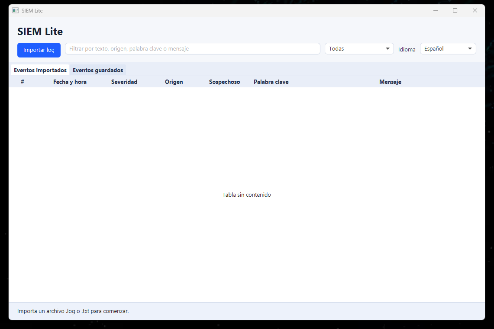
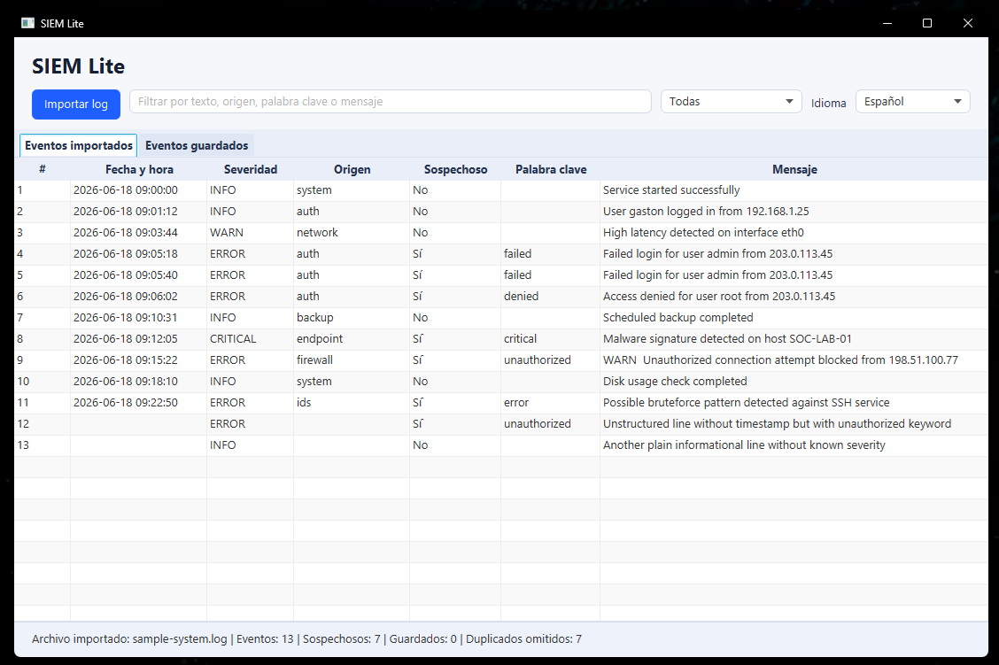
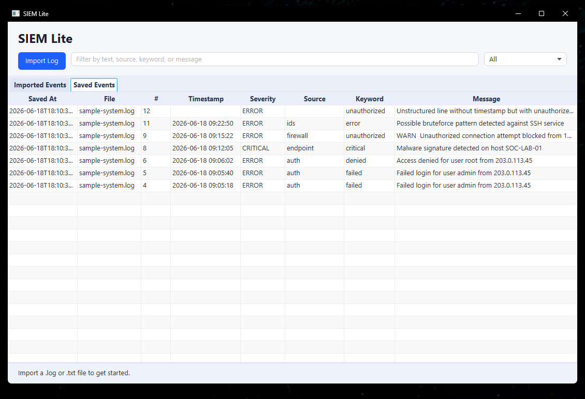
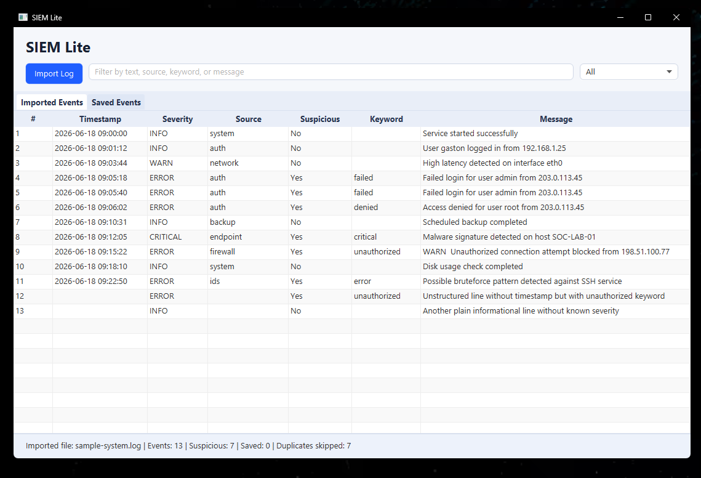

# SIEM Lite


SIEM Lite is a lightweight desktop application for local log analysis and basic SOC-style event triage. It helps users import log files, identify severity, flag suspicious events, persist findings locally, and use the interface in English or Spanish.

This project was built as a cybersecurity/SOC portfolio project. The goal is to demonstrate a practical SOC Analyst Level 1 workflow, clean Java structure, and a small but extensible foundation for future improvements.

## Product Vision

SIEM Lite aims to become a personal Windows SIEM for cybersecurity students, educators, homelabs, and entry-level SOC learning environments.

The project focuses on local Windows event monitoring, basic security analysis, educational explanations, and a simple desktop experience. It is not intended to replace enterprise SIEM platforms such as Splunk, Microsoft Sentinel, QRadar, or Wazuh.

Future versions aim to add Windows Event Log support, dashboard views, Learning Mode, Professional Mode, Knowledge Cards, Light/Dark/System themes, broader multilingual UI support, and productization work toward an installable desktop app.

See the full strategic roadmap in [docs/ROADMAP.md](docs/ROADMAP.md).

## Project Status

**Type:** Portfolio / educational desktop project  
**Current version:** v0.3.0  
**Production use:** Not intended for production use  
**Focus:** Local log analysis, suspicious event persistence, and localization foundation.

The current release is a public desktop version focused on local log analysis, suspicious event persistence, and localization foundation. It is not intended to be a full SIEM platform.

## Tech Stack

- Java 21
- JavaFX
- Maven
- SQLite
- JUnit 5

## Current Features

### Log import and analysis

- Import `.log` and `.txt` files.
- Parse logs line by line.
- Display line number, timestamp, severity, source, suspicious flag, matched keyword, and message.
- Filter imported events by text.
- Filter imported events by severity.

### Suspicious event detection

- Keyword-based suspicious activity detection.
- Basic severity classification.
- Matched keyword display.
- Sample log file at `samples/sample-system.log`.

Current suspicious keywords include:

- `failed`
- `denied`
- `unauthorized`
- `error`
- `critical`
- `malware`
- `bruteforce`

### SQLite persistence

- Local SQLite database.
- Automatic database initialization.
- Automatic save for suspicious events detected during log import.
- Read-only `Saved Events` tab.
- Duplicate prevention using a content hash.

Local data is stored at:

```text
%APPDATA%\SIEM Lite\data\siem-lite.db
```

### Localization foundation

- English as the default and fallback language.
- Initial Spanish support.
- Java `ResourceBundle` based UI text externalization.
- Language selector in the main interface.
- Local language preference stored under the user's AppData config directory.
- Saved language applied when the application starts.
- Restart required to apply all interface changes in v0.3.0.

## Screenshots

### Spanish UI

The main interface can load in Spanish using externalized ResourceBundle messages.



### Localized import flow

The log import flow remains functional with localized UI labels, table headers, status messages, and Yes/No suspicious indicators.



### Saved Events persistence

Suspicious events are stored locally in SQLite and remain available after restarting the application.



### Duplicate prevention

Re-importing the same log file does not duplicate saved suspicious events. Existing records are skipped using a content hash.



## Local Data / Privacy Note

- SIEM Lite stores saved suspicious events locally in a SQLite database.
- On Windows, the database is stored under `%APPDATA%\SIEM Lite\data\siem-lite.db`.
- The selected language preference is stored locally under `%APPDATA%\SIEM Lite\config\settings.properties`.
- Saved records may include the original log line, parsed event metadata, imported file name, and local imported file path.
- This version does not add cloud sync, telemetry, or remote upload.
- Users can delete the local database file to clear saved events.

## How To Run

Requirements:

- JDK 21
- Maven

Compile the project:

```bash
mvn clean compile
```

Run the application:

```bash
mvn javafx:run
```

Run tests:

```bash
mvn clean test
```

## How To Test With The Sample Log

1. Run the application with `mvn javafx:run`.
2. Optionally switch the language from the language selector.
3. Restart the application if you changed the language.
4. Click `Import Log`.
5. Select `samples/sample-system.log`.
6. Review the imported events in the table.
7. Review automatically saved suspicious events in the `Saved Events` tab.
8. Re-import the same sample file to confirm duplicate prevention.
9. Try text filters such as:
   - `admin`
   - `malware`
   - `unauthorized`
   - `bruteforce`
10. Try severity filters such as:
   - `ERROR`
   - `CRITICAL`
   - `WARN`

When a log is imported, suspicious events are saved automatically to SQLite. Reimporting the same file skips duplicate suspicious events.

## Roadmap

### Near-term

- `v0.3.x`: Localization foundation and event history improvements.
- `v0.4.x`: Local Windows Event Log support.
- `v0.5.x`: Windows-focused detection rules and theme architecture.

### Long-term

- `v0.6.x`: Dashboard.
- `v0.7.x`: Basic correlation.
- `v0.8.x`: Learning Mode, Professional Mode, localized Knowledge Cards, and educational content.
- `v0.9.x`: Background mode, notifications, installer, QA, and release candidate hardening.
- `v1.0.0`: Stable personal Windows SIEM release.

## Current Limitations

SIEM Lite is still a local desktop application for learning and portfolio purposes.

The current version does not include:

- Windows Event Log integration.
- Real-time monitoring.
- Dashboards or alerting.
- User accounts or roles.
- Enterprise SIEM integrations.
- Live language switching without restart.

## Release History

- `v0.1.0` - Initial Portfolio Release
  - Basic JavaFX log import, parsing, filtering, and suspicious event detection.
- `v0.2.0` - SQLite Persistence
  - Local SQLite persistence, `Saved Events` tab, and duplicate prevention.
- `v0.3.0` - Localization Foundation
  - English/Spanish foundation, language selector, saved language preference, and ResourceBundle fallback.

## License

This project is licensed under the MIT License. See [LICENSE](LICENSE) for details.
