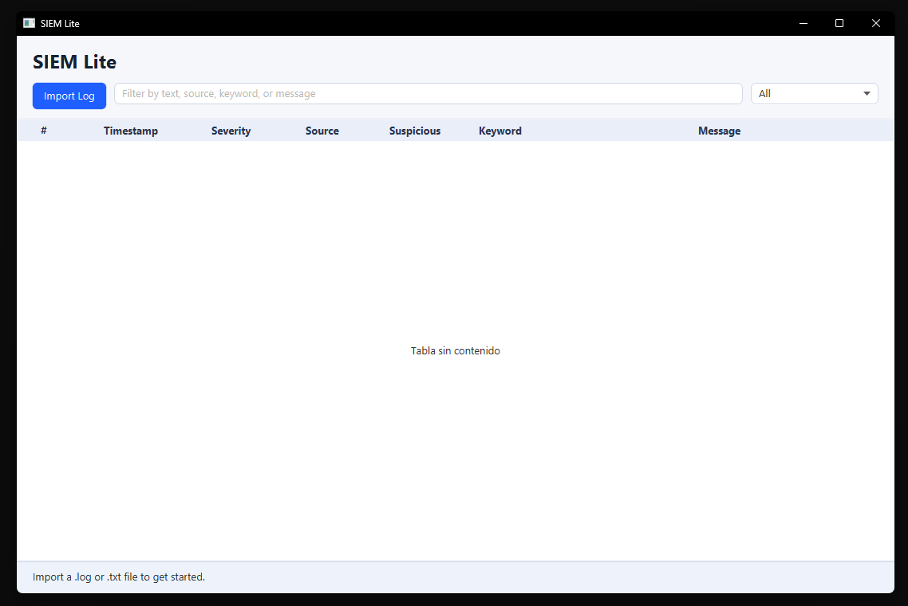
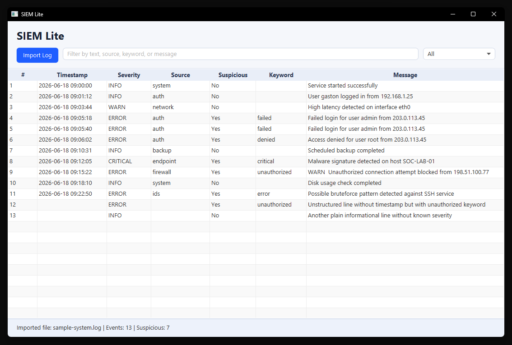
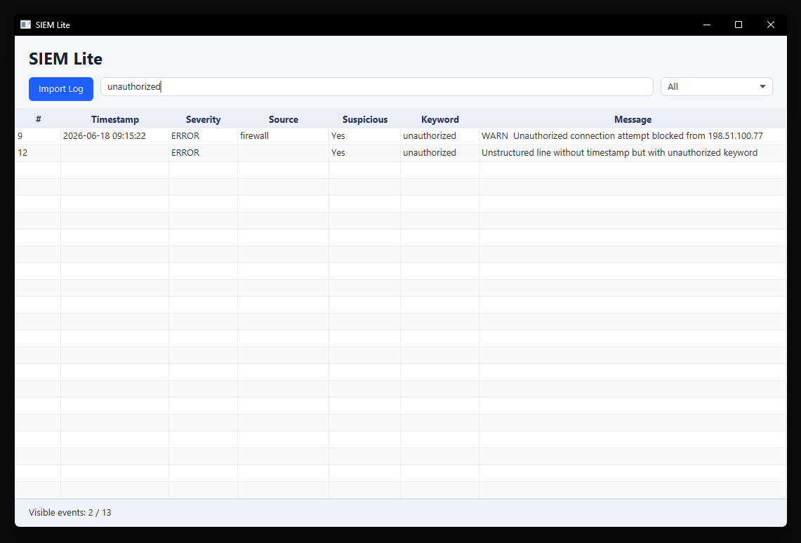

# SIEM Lite


SIEM Lite is a lightweight desktop application for basic log analysis. It allows users to import `.log` and `.txt` files, parse them line by line, detect suspicious events using simple hardcoded keywords, and filter the results in a JavaFX table.

This project was built as a cybersecurity/SOC portfolio project. The goal is to demonstrate a practical SOC Analyst Level 1 workflow, clean Java structure, and a small but extensible foundation for future improvements.

## Product Vision

SIEM Lite aims to become a personal Windows SIEM for cybersecurity students, educators, homelabs, and entry-level SOC learning environments.

The project focuses on local Windows event monitoring, basic security analysis, educational explanations, and a simple desktop experience. It is not intended to replace enterprise SIEM platforms such as Splunk, Microsoft Sentinel, QRadar, or Wazuh.

Planned capabilities include local SQLite persistence, Windows Event Log support, dashboard views, Learning Mode, Professional Mode, Knowledge Cards, Light/Dark/System themes, and multilingual UI support.

Planned language support includes English as the base fallback language, with initial support for Spanish, Chinese, Hindi, and Arabic. Translation quality and RTL layout support will be improved progressively before `v1.0.0`.

See the full strategic roadmap in [docs/ROADMAP.md](docs/ROADMAP.md).

## Project Status

**Type:** Portfolio project  
**Current version:** v0.1.0  
**Production use:** Not intended for production use  
**Focus:** Demonstrating basic SOC-style log triage concepts through a small Java desktop application.

The current release is a first public functional version. It is not intended to be a full SIEM platform.

## SOC / Portfolio Objective

The v0.1.0 release simulates a simple SOC-style log review flow:

- Load log evidence from a local file.
- Identify basic event severity.
- Flag potentially suspicious events.
- Filter events by text or severity.
- Keep the codebase simple enough to explain during a technical interview.

## Tech Stack

- Java 21
- JavaFX
- Maven
- JUnit 5

## v0.1.0 Features

- JavaFX desktop interface.
- Import `.log` and `.txt` files.
- Generic line-by-line parser.
- `LogEvent` model.
- Event table with line number, timestamp, severity, source, suspicious flag, matched keyword, and message.
- Simple keyword-based detection:
  - `failed`
  - `denied`
  - `unauthorized`
  - `error`
  - `critical`
  - `malware`
  - `bruteforce`
- Text filter.
- Severity filter.
- Sample log file at `samples/sample-system.log`.
- Basic unit tests for parser, detection, and filtering services.

## Screenshots

### Main screen



### Imported log



### Filtered suspicious events



## How To Run

Requirements:

- JDK 21
- Maven

Compile the project:

```bash
mvn clean compile
```

Run the application:

```bash
mvn javafx:run
```

Run tests:

```bash
mvn clean test
```

## How To Test With The Sample Log

1. Run the application with `mvn javafx:run`.
2. Click `Import Log`.
3. Select `samples/sample-system.log`.
4. Review the imported events in the table.
5. Try text filters such as:
   - `admin`
   - `malware`
   - `unauthorized`
   - `bruteforce`
6. Try severity filters such as:
   - `ERROR`
   - `CRITICAL`
   - `WARN`

## Roadmap

### Near-term

- `v0.2.x`: Local SQLite persistence and AppData settings foundation.
- `v0.3.x`: Localization foundation, language selector, and event history.
- `v0.4.x`: Local Windows Event Log support.
- `v0.5.x`: Windows-focused detection rules and theme architecture.

### Long-term

- `v0.6.x`: Dashboard.
- `v0.7.x`: Basic correlation.
- `v0.8.x`: Learning Mode, Professional Mode, localized Knowledge Cards, and educational content.
- `v0.9.x`: Background mode, notifications, installer, QA, and release candidate hardening.
- `v1.0.0`: Stable personal Windows SIEM release.

## Out Of Scope For v0.1.0

- SQLite persistence.
- PostgreSQL integration.
- Dashboard.
- Event history.
- Configurable detection rules.
- CSV/PDF export.
- User login or role management.

## License

This project is licensed under the MIT License. See [LICENSE](LICENSE) for details.
